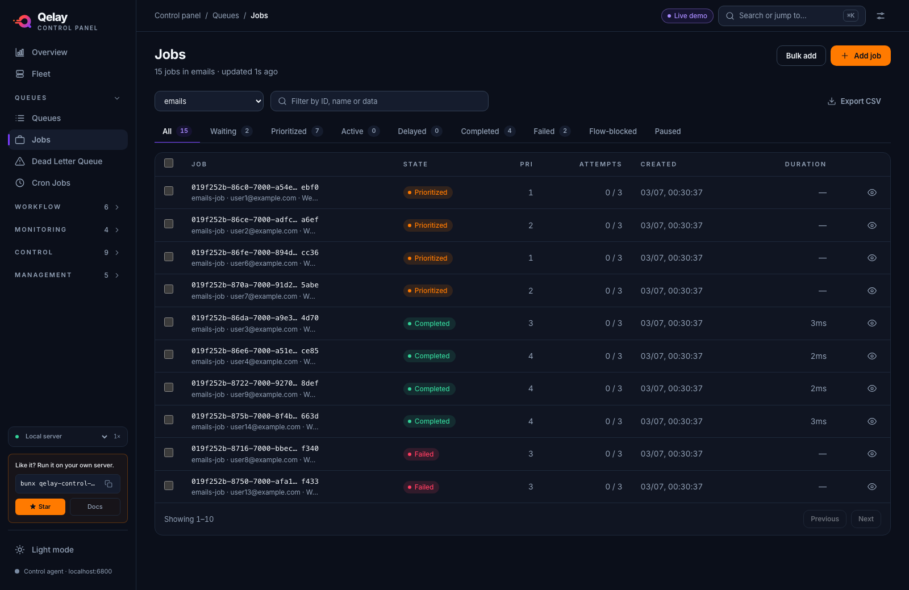

# Jobs

Browse, filter, inspect and export the jobs in a queue. Delayed jobs can be promoted,
while DLQ retry and completed-job requeue fail closed.

**Where:** open **Jobs** under Queues in the sidebar (`/jobs`).

## What you'll see

A header with the selected queue and how fresh the list is, a toolbar, a row of state tabs, and the job table. Everything updates on its own, you don't need to refresh.

**Header**

The subtitle reads "N jobs in `<queue>` · updated Ns ago". On the right are two buttons: **Bulk add** (opens [Bulk Add Jobs](/guide/bulk-add)) and the orange **Add job** (opens [Add Job](/guide/add-job)). Neither one pre-fills the queue you are looking at.

**Toolbar**

| Element | What it does |
| --- | --- |
| Queue select | Chooses whose jobs to list. |
| Filter input | "Filter by ID, name or data". Narrows the rows on screen. |
| **Export CSV** | Downloads the rows currently on screen. |

**State tabs**

**All**, **Waiting**, **Prioritized**, **Active**, **Delayed**, **Completed**, **Failed**, **Flow-blocked** and **Paused**. Most tabs carry the queue's count for that state. The counts come from the queue summary, which is refreshed less often than the table, so they can run a few seconds behind. **Flow-blocked** and **Paused** show no number, and the footer shows no total on **All**.

**Job table**

| Column | What it tells you |
| --- | --- |
| Checkbox | Selects the row. The header checkbox selects the whole page. |
| **Job** | The job's ID, shortened in the middle when it is long, with its name and the first two values of its payload underneath. |
| **State** | The job's current state as a colored badge. |
| **Pri** | The priority, as a plain integer. |
| **Attempts** | Attempts made out of the maximum allowed. |
| **Created** | A time for jobs created today, day/month and time earlier this year, and the full date before that. |
| **Duration** | How long the job took to run. Shows a dash until the job has both started and finished. |
| Eye icon | Opens the job in the [Job Inspector](/guide/job-inspector). Delayed rows also show **Promote**. |

On narrow screens the table scrolls sideways inside its card instead of squeezing the columns.

The footer reads "Showing 1–25" (or "Showing 1–9" on a short page) with **Previous** and **Next**. While a filter is active it adds "N of M on this page match".

## What you can do

**Pick a queue.** Use the queue select. A link that arrives with `?queue=<name>` pre-selects it; otherwise the first queue is chosen for you.

**Filter by state.** Click a tab. A link that arrives with `?status=failed` (or any state name) opens on that tab, which is how **Review failed jobs** on the [Overview](/guide/overview) lands here.

**Filter the page.** Type in the filter input to match a job's ID, name or payload. It searches only the rows currently loaded (see Good to know).

**Inspect a job.** Click the eye icon on any row to open the [Job Inspector](/guide/job-inspector).

**Promote delayed jobs.** A delayed row has a **Promote** button that moves the job to run now. To promote several at once, tick the checkboxes and use **Promote** in the selection bar. It appears only when at least one selected job is delayed; otherwise the bar says "No actions apply to the selected job states." If the filter hides the selected jobs, it says "The selected jobs are hidden by the filter — clear it to act on them." **Clear** empties the selection.

**Export CSV.** Download the rows on the current page. If there are none, a toast says "No jobs to export on this page".

**Empty and error states.** "No jobs in `<queue>`" means the queue has none in that state, "No matching jobs" means the filter excludes everything on the page, "Select a queue" appears before one is chosen, and "Queues unavailable" appears if the queue list could not be loaded.

::: warning Unsafe lifecycle transitions fail closed
The control panel never exposes `DELETE /jobs/:id`. Bunqueue v2.9.3 cannot reveal
every reverse flow dependency, so deleting an apparently standalone job can
permanently strand another queue's parent. DLQ retry is also unavailable because
its GET + POST sequence has no atomic generation/state/topology precondition and
can hit a recreated job. Completed-job requeue is unavailable because
`retryCompleted` does not rebuild dependency registration or flow order.
:::

After a promote, the list refreshes and a toast reports success or failure. Buttons on a busy row are disabled until it finishes.

## Good to know

- **The filter only searches the current page.** It matches the 25 rows on screen, not the whole queue. To find one specific job in a large queue, use the Job Inspector's direct lookup instead.
- **There's no "page X of Y."** You page through 25 jobs at a time. **Next** stays available as long as a full page arrives; a shorter page means you've reached the end.
- **Tab counts are partial.** They describe the queue's states, not the filtered rows, and a few tabs show no number at all.
- **Which actions appear depends on the job's state.** A delayed job can be promoted. Active, completed and failed jobs have no state-changing row action.
- **Changing queue, state, or page clears your selection.** This is on purpose, so a bulk action can never hit rows you picked under a different view.
- **If the server is unreachable,** a banner with a **Retry** button appears and your already-loaded rows stay visible.
- This `/jobs` page is the corrected, server-paginated one. A separate legacy jobs page exists at `/jobs-classic` but isn't what this screen uses, see [Known issues](/known-issues).

::: details Under the hood (for developers)
Everything here uses the shape-verified `bq` client (not the legacy `api` client).

- Queue select and state-tab counts: `GET /queues/summary`, polled every 30 s. There is no stats-card row and no `/dashboard` poll on this page any more.
- Job table: `GET /queues/:q/jobs/list?states=…&limit=25&offset=…`, polled at the global refresh interval (default 3 s, configurable in Settings). The response is flat `{ ok, jobs }` with no `total`, so "next page" is inferred from a full 25-row page (`JOBS_PAGE_SIZE`).
- The "updated Ns ago" text ticks once a second from its own small component, so the table doesn't re-render on every tick.
- The only job-lifecycle mutation maps to `POST /jobs/:id/promote`. Which actions apply to which state lives in `actionGates` in `src/lib/jobActions.ts`; this page never calls DLQ retry or retry-completed endpoints.
- Source: `src/pages/control/JobsPro.tsx`, composed from `src/pages/control/jobsPro/`.
:::
