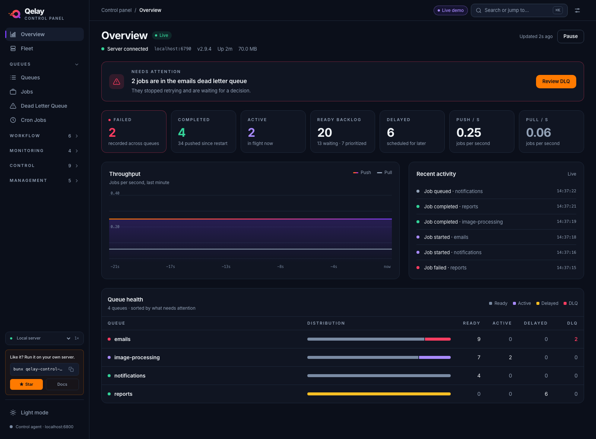

# Overview

A single screen that shows, at a glance, whether your bunqueue server is healthy and what your queues are doing right now.

**Where:** Home (the landing page).

## What you'll see

From the top down: a header with the server's connection state, a **Needs attention** panel that appears only when something needs a decision, one row of headline numbers, a throughput chart beside a live activity feed, and a table of your queues. Everything updates on its own, you don't need to refresh.

**Header**

The title carries a **Live** pill while data is flowing (**Paused** if you paused it). Under it, one line shows the connection and the server's vitals:

| Element | What it tells you |
| --- | --- |
| Green dot · "Server connected" | The latest check reached the server; the numbers are fresh. |
| Amber dot · "Connection lost — showing last known data" | The latest check failed; you're seeing the last numbers received, which may be a little old. An offline banner with a **Retry** button appears too. |
| Address, `v…`, `Up …`, memory | The server address, its version, how long it's been running and how much memory it's using. |

On the right, **Updated Ns ago** and a **Pause** / **Resume** button.

**Needs attention**

A panel that stays hidden while all is well. It shows in two cases, and dead-lettered jobs win over failed ones because they have stopped retrying:

| Condition | Headline | Button |
| --- | --- | --- |
| Jobs are in the DLQ | "2 jobs are in the emails dead letter queue" (or "… across N queues") | **Review DLQ**, opening [Dead Letter Queue](/guide/dlq), filtered to the queue when only one holds jobs |
| No DLQ jobs, but failed jobs exist | "N failed jobs recorded across your queues" | **Review failed jobs**, opening [Jobs](/guide/jobs) filtered to failed jobs in the worst queue |

**Headline numbers**

| Element | What it tells you |
| --- | --- |
| Failed | Current failed jobs summed across queues. Shown only while there are any, in red. |
| Completed | Retained completed jobs, with how many were pushed since the server restarted. |
| Active | Jobs being processed now. |
| Ready backlog | Waiting plus prioritized jobs across queues. Turns amber above 100. |
| Delayed | Jobs scheduled for later. |
| Push / s, Pull / s | Current rates in jobs per second. |

**Throughput** plots push and pull rates. The chart is built from this page's own refreshes, so it starts empty and grows to five minutes of history; its subtitle ("last minute", "last 5 minutes") always matches what is actually plotted. If the connection drops for a while, or you switch server, the chart starts over rather than drawing a line across the gap.

**Recent activity** is a live feed of the last six job events, each with a colored dot, what happened, the queue, and the time. It reads "Connecting…" or "Reconnecting…" when the event stream isn't up.

**Queue health** lists up to eight queues, sorted by what needs attention: those with DLQ jobs first, then failed jobs, then the biggest ready backlog. Each row shows a bar of how its jobs split plus the **Ready**, **Active**, **Delayed** and **DLQ** counts (the bar is hidden on narrow screens). DLQ counts are red when above zero. Missing values use a dash (—).

## What you can do

This screen is for watching, not changing, there are no destructive actions here. You can:

- **Open a queue**, click a queue's name in Queue health to jump into its details.
- **See all queues**, click **View all N queues** under the table when there are more than eight.
- **Review problems**, click **Review DLQ** or **Review failed jobs** in the Needs attention panel.
- **Pause updates**, click **Pause** to freeze the numbers (for example while you read them), and **Resume** to refresh at once. Pause only stops the periodic refresh; the activity feed stays live.
- **Reconnect**, when the offline banner appears, click **Retry** to check the server again right away.

## Good to know

::: tip
The screen refreshes on its own every few seconds. An amber "Connection lost" line means only the *last* check failed, the server may still be up, and your numbers are simply a few seconds old. Click **Retry** to check again.
:::

- **Recent activity starts empty.** It fills as new events arrive and doesn't load past history. For the full picture, open [Logs](/guide/logs).
- **Queue health shows eight queues.** If you have more, use **View all** to see them.
- **A dash (—) means "not available yet,"** not zero.
- **The throughput chart has no history before you opened the page.** For longer trends, use [Metrics](/guide/metrics).

For a plain-language list of current limits, see [Known issues](/known-issues).

::: details Under the hood (for developers)
- Uses the shape-verified `bq` client plus a shared activity-stream hook.
- Polls four endpoints together, `GET /dashboard`, `GET /queues/summary`, `GET /health` and `GET /dashboard/queues?limit=500`, on the global refresh interval (default 3000 ms), with at most one request in flight. `/health` and the queue pager fail soft: the page still renders without the version or the per-queue DLQ counts.
- Per-queue DLQ counts come from the existing queue pager, not one request per queue.
- Live events come from the `/events` SSE stream (250-event ring buffer, ~150 ms flush, 2000 ms reconnect backoff).
- Source: `src/pages/control/OverviewPro.tsx`, composed from `src/pages/control/overview/`.
:::
