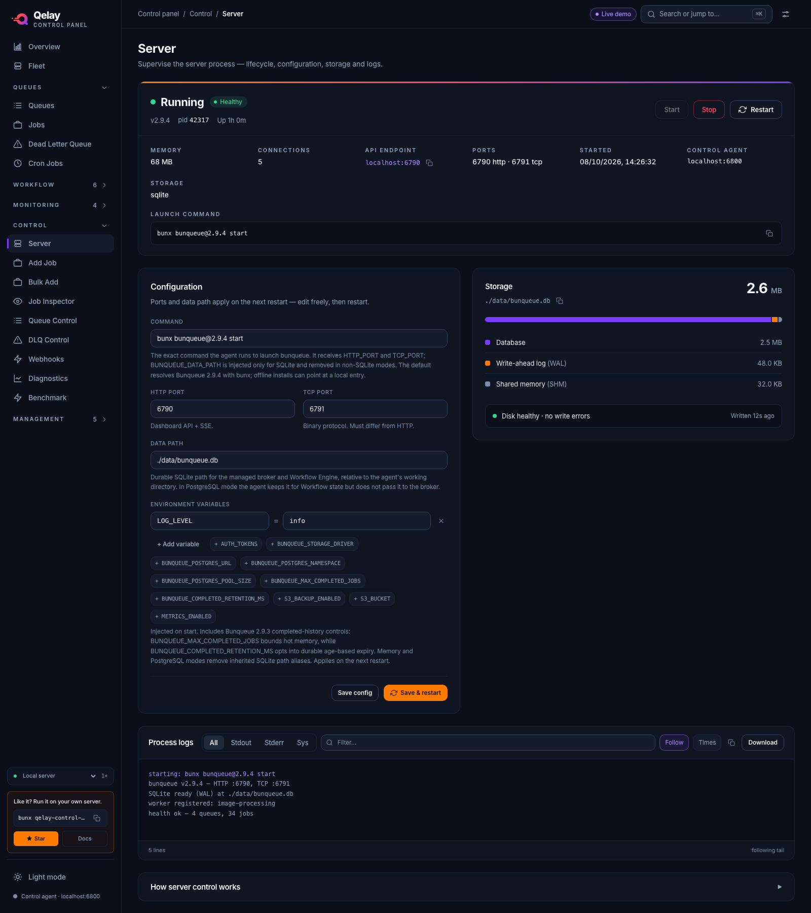

# Server Control

Server Control is where you start, stop, and restart the bunqueue server, set how it launches, and watch its logs live.

**Where:** **Control ▸ Server** in the sidebar (`/server`).

## What you'll see

Top to bottom: a **status bar** with the lifecycle buttons, a grid of **facts** about the running process and the exact **launch command**, a **Configuration** card beside a **Storage** panel, the live **Process logs** tail, and a collapsed "How server control works" explainer. While the page waits for the first answer from the control agent it shows "Reaching the control agent…".

**Status bar**

A colored dot and a large state word tell you where things stand: green for running, amber while starting or stopping, red when stopped. A pulsing ring appears only when the server is running *and* healthy. Next to it, a pill adds detail:

| Pill | What it means |
| --- | --- |
| **Healthy** | The process is running and its health check passes. |
| **Waiting for health** | The process is running but hasn't passed its health check yet. |
| **Crashed · exit N** | The process ended on its own with exit code N. |
| **Agent unreachable** | The control agent stopped answering; the page shows the last state it knew. |

Under the state word you see the server's version, the process id and a live-ticking uptime. When the server is stopped the line reads "The server is not running — start it, or point the dashboard at an external server."

On the right are **Start**, **Stop** (a red outline) and **Restart**. Only the buttons that make sense are enabled: Start while stopped, Stop while running, and none of them while a change is in progress.

A thin gradient rule runs along the top edge of the bar.

**Facts**

| Element | What it tells you |
| --- | --- |
| **Memory** | Current memory use of the server, in MB. Hover for heap detail. A dash while stopped. |
| **Connections** | Total live connections. Hover for the TCP, WebSocket and SSE split. |
| **API endpoint** | The server's address (host and port). The copy button copies the full URL. |
| **Ports** | The HTTP and TCP ports in use. |
| **Started** | When the process started (shown only while running). |
| **Control agent** | The address of the local agent that manages the process. |
| **Storage** | The storage driver (`sqlite`, or `postgres` with its namespace). A dash if the agent doesn't report it. |

Below the facts, the **Launch command** row shows the exact command the agent runs, with a copy button.

**Configuration**

The settings the server will launch with next time you start or restart it:

| Element | What it tells you |
| --- | --- |
| **Command** | The command the agent runs to launch bunqueue (default `bunx bunqueue@2.9.4 start`). |
| **HTTP port** | The API and live-update port (1 to 65535). |
| **TCP port** | The binary-protocol port. Must differ from the HTTP port. |
| **Data path** | Where the SQLite database file lives. |
| **Environment variables** | Editable `KEY = value` rows for any extra settings you want to pass in, with preset chips for common ones and **+ Add variable** for the rest. |

The footer has **Save config** and, only while the server is running, the orange **Save & restart**. While the server is stopped, **Save config** is the orange button instead. One orange action at a time keeps the safe choice obvious.

**Storage**

The SQLite database's footprint on disk as one proportional bar: the main **Database** file plus its **Write-ahead log (WAL)** and **Shared memory (SHM)** sidecars, with the total size, the file path (copyable), and a status line such as "Disk healthy · no write errors" with "Written Ns ago". Before the server has ever run, it shows a placeholder explaining the file appears after the first start.

**Process logs** is a live tail of the server's output. Error lines show in red, agent messages in blue, normal output in muted gray. A footer shows the line count and whether the view is following the tail or paused.

## What you can do

### Attach-only mode

Set `BUNQUEUE_MANAGED=0` when another supervisor owns the Bunqueue process. The
status bar is then labeled **External** and reflects the agent's authenticated
`BUNQUEUE_URL/health` probe. A reachable but degraded response ("reachable but
unhealthy") is distinguished from an unreachable endpoint. The page shows only the
health facts and a **Managed externally** card. Start, Stop, Restart, the launch
command, launch configuration, local storage statistics and child-process logs are
hidden because they do not describe the external process; direct lifecycle/config
requests also fail with HTTP 409. Backup restore is likewise unavailable: it requires
proof that the database owner is stopped, which the attach-only agent cannot obtain
from the supervisor.

Unset the variable or set it to `1` to use the managed controls documented below.

**Start the server.** Click **Start** and the agent launches bunqueue with your saved configuration.

**Stop the server.** Click **Stop** to shut it down.

::: warning
Stop asks you to confirm ("Stop the server?") because it terminates the running process. The prompt also says how many live connections would be dropped.
:::

**Restart the server.** Click **Restart** to stop and start it again, the fastest way to apply configuration changes. This also asks for confirmation.

**Edit and save the launch configuration:**

1. Change the command, ports, data path, or environment variables in the Configuration card.
2. Click **Save config** to store your changes for the next start (a "Saved" note flashes for a moment).
3. To apply them right away instead, click **Save & restart**, this saves *and* restarts in one step. It confirms first and only appears while the server is running.

If the saved configuration changed somewhere else while you were editing, a **Reload latest** button appears next to the buttons so you can pick up the newer values.

**Manage environment variables.** Add a variable with **+ Add variable**, remove one with the `✕` button, or click a preset chip (like `LOG_LEVEL` or `AUTH_TOKENS`) to add a common setting fast. These stay in the form until you save.

**Work with the logs.** Filter by stream (**All** / **Stdout** / **Stderr** / **Sys**), search the text in the **Filter…** box, toggle **Follow** to auto-scroll (or turn it off to read back without being pulled to the bottom), toggle **Times** to show timestamps, **Copy** what's shown, or **Download** it as a `.log` file.

::: tip Ports are checked before anything is saved
Both **Save config** and **Save & restart** validate your ports first: each must be a whole number from 1 to 65535, and the HTTP port must differ from the TCP port. If a port is invalid, nothing is saved and an error appears in red next to the buttons.
:::

## Good to know

- **Configuration never applies in place.** Changes to the command, ports, or data path only take effect on the **next start or restart**, the running server keeps what it launched with. Use **Save & restart** to apply immediately. When your saved config is ahead of the running one, a "Restart to apply changes" hint appears next to the buttons.
- **The default command resolves Bunqueue 2.9.4 through `bunx`.** For offline or source-checkout workflows, point **Command** at a local entry instead, for example `bun run /path/to/bunqueue/src/main.ts`.
- **PostgreSQL multi-broker mode:** add `BUNQUEUE_STORAGE_DRIVER=postgres` and
  `BUNQUEUE_POSTGRES_URL=…` under Environment variables, plus the same
  `BUNQUEUE_POSTGRES_NAMESPACE` on every member. Create one connection profile
  and paired control agent per broker; [Fleet](/guide/fleet) groups members by
  the credential-free `host:port/database` target and namespace and can operate
  each lifecycle independently. Keep **Data path** on a durable location if you
  use the Workflow Engine: the agent retains it for Workflow state
  but removes every SQLite path alias from the PostgreSQL broker environment.
  Database inspection and S3 snapshots remain SQLite-only and return a clear
  unavailable response while PostgreSQL is active. Bunqueue 2.9.3 uses
  PostgreSQL schema 20 (the published 2.9.2 package used schema 19): upgrade every broker sharing the
  namespace together; an older broker cannot join after migration to schema 20.
- **SQLite 2.9.3 migration:** make a copy of the database before the first
  start. Bunqueue upgrades it to schema 37 before binding the server and resumes
  checkpointed migrations after a restart. Do not try to downgrade a database
  after a partial or completed migration.
- **Completed history has two separate controls.** `BUNQUEUE_MAX_COMPLETED_JOBS`
  caps the hot in-memory/recovery snapshot; it no longer deletes durable rows.
  Set `BUNQUEUE_COMPLETED_RETENTION_MS` only when durable completed jobs should
  expire by age. Both are available as Environment-variable presets in Server
  Control and take effect on restart.
- **The data path's folder must already exist.** The server creates the database *file* but not its parent *folder*. A start that fails with a "cannot open" error usually means the directory isn't there yet, create it, or pick a path whose folder already exists.
- **Logs don't keep forever.** Only the most recent ~800 lines are held, so older output scrolls off. Use **Download** to save a copy you want to keep.
- **When the agent can't be reached**, the page tells you plainly. If it was never reachable, a "Control agent not running" card shows the address it tried and how to start the agent (`bun start`, or `bun run agent`). If it stops responding after working, an amber banner shows the last known state and the Start/Stop/Restart buttons are disabled until it answers again, this is intentional, so the page never claims a dead server is "healthy." It reconnects on its own once the agent is back; no reload needed. See [Known issues](/known-issues).
- **Memory and Connections need a running server.** Those vitals come from the live server, so they read as a dash whenever it's stopped. A running server can also report zero connections when nothing is attached.

::: details Under the hood (for developers)
- Lifecycle, configuration, and logs all go through the local **control agent** (`bq.control.*`, default `http://localhost:6800`): `GET /control/status` is the primary poll, `POST /control/start|stop|restart` drive the process, `PUT /control/config` persists config to the agent's private settings file, and `GET /control/logs` feeds the log tail.
- The live **Memory** and **Connections** vitals come from the bunqueue server's own `GET /health` (via `bq.health()`, called with `strict:false`) and are polled only while the process is running. The Storage panel reads `GET /storage`.
- Polling uses the global refresh interval from Settings, **3000 ms by default** (floored at 500 ms), at most one request in flight. There is no SSE on this page; the uptime clock is a separate client-side 1-second ticker.
- Source: `src/pages/control/ServerControl.tsx`, composed from `src/pages/control/server/` (`StatusConsole`, `StatusFacts`, `ConfigCard`, `StoragePanel`, `ProcessLogs`, `AgentInfoCard`).
:::

Saved server settings survive agent and control panel restarts. The default file is
`.qelay-control-panel/config.json` in the launch directory; service installations
can select an absolute `AGENT_CONFIG_PATH`. A file left at the old
`.bunqueue-dashboard/config.json` is copied there the first time the agent starts
without one, and the old file is never deleted. Saved settings take precedence over
initial environment defaults. Loading them does not start the server automatically.
